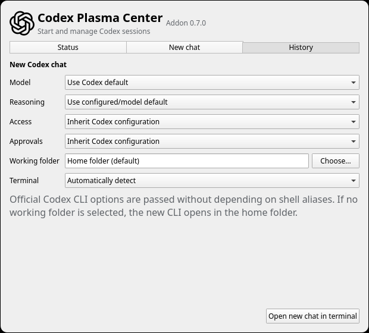

# Codex Plasma Center for Plasma 6

An unofficial KDE Plasma widget for checking Codex account usage and managing
saved Codex chats from the panel.

This project is not affiliated with or endorsed by OpenAI.

The panel uses the official OpenAI Blossom to identify Codex. The mark remains
OpenAI property, is not covered by this project's MIT license, and does not
imply affiliation or endorsement. See [TRADEMARKS.md](TRADEMARKS.md).

> [!NOTE]
> The project is in early development. Version 0.7.0 is the first public
> pre-release.

<p align="center">
  
</p>

The screenshot is rendered from a synthetic English fixture and contains no
real account, conversation, path, or usage data.

## Features

- Show whether Codex is available and authenticated.
- Show the account plan without exposing the account email or identifier.
- Show available usage windows as used and remaining percentages.
- Show reset times in the local time zone.
- Show optional token-activity summaries when Codex provides them.
- Offer a compact panel indicator and a detailed popup.
- Include the official Codex service icon in light and dark Plasma themes.
- Support manual and periodic refresh.
- Show active and archived interactive Codex chats in separate visual sections
  without displaying project paths.
- Search chat titles and load additional pages.
- Rename a saved chat through the documented app-server method.
- Resume a selected chat in a separate terminal window.
- Permanently delete an active or archived chat after explicit confirmation.
- Permanently delete all archived chats after two button confirmations.
- Use an available Codex limit reset after two button confirmations.
- Open a fresh Codex CLI in a detected terminal with optional model, reasoning,
  filesystem access, approval settings, and a selected working folder.
- Detect supported terminal emulators and remember an optional preference.
- Include English source strings and a Spanish translation.

## Use

Add the widget to a Plasma panel and open it to view every usage window that
the current Codex authentication mode exposes. The panel shows the remaining
percentage for the first available window. Open the widget settings to hide
that percentage or change the refresh interval.

Open the **History** tab to list saved interactive sessions. Search operates on
chat titles, with active and archived entries grouped separately. Renaming updates the user-facing
name stored by Codex. **Open in terminal** starts `codex resume` for the selected
UUID in a separate terminal window and does not send a prompt automatically.
Opening an archived chat first restores it through `thread/unarchive`.
Active and archived entries offer a permanent delete action backed by
`thread/delete`. Codex may also delete chats descended from the selected
thread, so every confirmation warns about that consequence.

**Delete all archived chats** first asks for two button confirmations, then
collects and validates every archived UUID, with a maximum of 1,000, before it
starts any deletion. It invokes `thread/delete` sequentially because app-server
has no bulk-delete method and warns that a failure can leave a partially
deleted archive.

The **Status** tab can use a limit reset only when Codex reports that one is
available. The action has two button confirmations and uses an idempotency key
for the reset attempt. The widget never selects or exposes opaque credit IDs.

The dedicated **New chat** tab can open a new interactive Codex CLI in a
separate terminal window.
Its model list comes from `model/list`. Model and reasoning are optional. The
access and approval selectors use the official `--sandbox` and
`--ask-for-approval` CLI options, so they do not depend on Fish, Bash, Konsole,
or another shell/terminal. Every selector defaults to inheriting the existing
Codex configuration. The full bypass option requires two explicit button
confirmations. A native folder picker can set the working folder for both the
terminal and Codex; leaving it unchanged preserves the current default of the
user's home folder. The terminal selector lists supported emulators detected
on the system, remembers the chosen identifier, and defaults to automatic
detection. No prompt is sent automatically.

The widget refreshes when it starts, whenever its popup opens, when the refresh
button is pressed, and at the configured interval.

Status refreshes call only Codex account read methods. They do not start or
resume a conversation or create a model turn.

## How it works

The widget uses small Python standard-library helpers. They start the
official `codex app-server` over local standard input/output, call a narrow set
of documented account and thread methods, remove fields the widget does not
need, and return normalized JSON to Plasma. Local CLI launches use argument
vectors and never construct a shell command from the selected values.

It does not parse or edit Codex session logs, inspect `auth.json`, expose
app-server on the network, store account history, or retain a chat index.

Codex app-server is currently marked experimental by the Codex CLI. The helper
isolates the protocol so compatibility changes do not need to spread into the
QML interface.

## Requirements

- KDE Plasma 6.
- Plasma 5 Support, for Plasma's executable data source.
- Python 3.10 or newer.
- Codex CLI with `codex app-server` support.
- An existing Codex login for ChatGPT usage limits and token activity.
- At least one supported terminal emulator: Konsole, GNOME Terminal, Kitty,
  Alacritty, WezTerm, Foot, or XTerm.

API-key-only and some third-party authentication modes do not expose ChatGPT
usage windows. The widget should report this as unavailable rather than as
zero usage.

## Install

Download `codex-plasma-center-0.7.0.plasmoid` from the
[GitHub Releases page](https://github.com/Cykes95/codex-plasma-center/releases/latest),
then install it for the current user:

```sh
kpackagetool6 --type Plasma/Applet --install codex-plasma-center-0.7.0.plasmoid
```

To install from a source checkout instead:

Install the unpacked widget for the current user:

```sh
kpackagetool6 --type Plasma/Applet --install package
```

Use `--upgrade` instead of `--install` after making changes.

No `sudo` command is needed or supported.

## Development and packaging

Run all local checks. The unit tests use fictional fixtures and do not contact
Codex:

```sh
make check
```

Build the translated `.plasmoid` package:

```sh
make package
```

The generated package is written to `dist/`, which is excluded from Git.

## Privacy and security

- No telemetry or analytics are implemented by this addon.
- No email address, account identifier, credential, prompt, conversation title,
  transcript, or project path is included in the source tree.
- The helper deliberately discards account email and opaque service IDs.
- Conversation titles, UUIDs, timestamps, and statuses are held only in the
  running QML process and are never logged or persisted by the addon.
- App-server is used only through a child process on local standard
  input/output.
- Renaming, restoring an archived chat, explicitly deleting chats, and using a
  confirmed limit reset are the only operations that change Codex data.
  Deletion is permanent.
- Starting a new CLI may select a model, reasoning effort, sandbox, and approval
  policy for that new process. The addon does not edit Codex configuration,
  authentication, prompts, or existing conversation turns.

See [PRIVACY.md](PRIVACY.md) and [SECURITY.md](SECURITY.md) for the complete
project policies.

## Independent implementation

Codex Plasma Center is independently designed against the documented Codex
app-server protocol and KDE Plasma APIs. No source code from similarly named
menu bar or Plasma projects is used.

## License

MIT. See [LICENSE](LICENSE).
